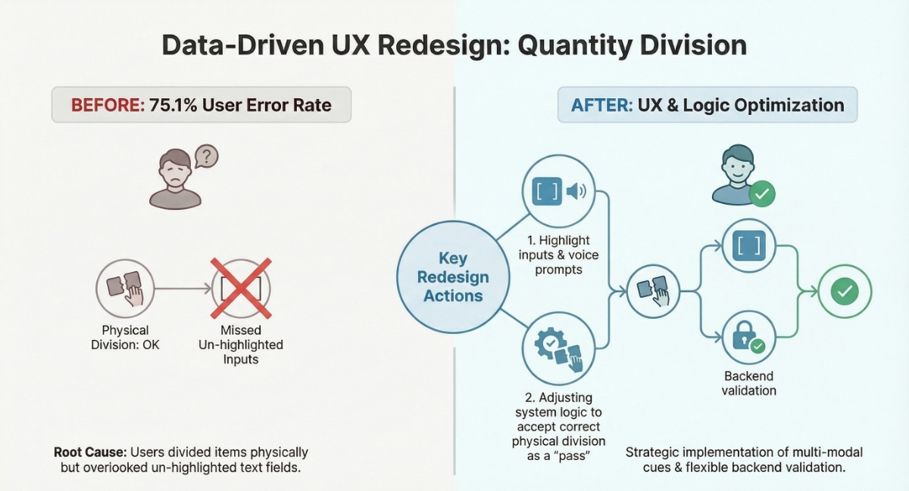

# 🚀 Data-Driven Product Optimization & User Growth Practice


**Project Role:** Data Analytics Manager / Project Lead  
**Domain:** EdTech / Interactive Kids Online Courses  
**Core Tech Stack:** Advanced SQL (Hive/Presto), JSON Parsing, Funnel Analytics, A/B Testing, Project Management, Team Leadership   

## 📌 Executive Summary & Business Value
The core business objective of this project was to optimize product content, enhance user experience, and improve retention[cite: 5]. [cite_start]By leading a 2-person analytics team and shifting our operational model from reactive troubleshooting to proactive data-driven intervention, we successfully reduced user churn and drove measurable conversion growth in highly interactive online kids' classes.

**Core Outcomes:**
* **Leap in Product Experience & Retention:** Successfully optimized core interactive course content. A/B testing verified that the optimized courses achieved a **31% increase in user satisfaction** and an **18% lift in user retention** .
* **Boosted Organizational R&D Efficiency:** Established a "Courseware Optimization Database," solidifying it as the core reference standard for the Pedagogy and Interaction departments. This boosted human resource efficiency by **30%+** and reduced average course production time from **30 hours to 20 hours** .

---

## 📂 Repository File Structure
To ensure full transparency and reproducibility of the analytical pipeline, this repository is organized as follows:

```text
Data-Driven-Product-Growth/
├── 00_Environment_Setup/          # Database schemas & automated data synthesis
│   ├── ddl_schema.sql             # Table structures (fact_event_streams, etc.)
│   └── mock_data_generator.py     # Python script with weighted anomaly logic
├── 01_SQL_Scripts/                # Core analytical logic
│   ├── micro_funnel_bpse.sql      # B-P-S-E granular funnel & JSON parsing
│   └── anomaly_detection.sql      # Automated secondary error rate calculations
└── images/                        # Visual assets (SOPs, Mindmaps, UI comparisons)
````

-----

## 💡 Core Strategy: Granular Behavior Trajectory Tracking

I abandoned coarse-grained page funnels. Instead, by parsing unstructured raw data, I built a highly granular **User Behavior Trajectory Tree**, tracking the complete user journey from:
`Entering Module -> Encountering Task -> Specific Scene -> Micro-interaction`.

This allowed us to pinpoint interaction nodes that caused repeated user errors and high-frequency misoperations, providing clear, data-driven guidance for content R\&D.

-----

## 🏗️ Technical Pipeline & SQL Implementation

### Phase 1: Environment Setup & Data Synthesis

Created the structural schema for event streams and generated mock JSON payloads containing controlled "frequent errors" to demonstrate the logic without exposing sensitive company data.

<details>
<summary>▶ Click to Expand: DDL for Event Stream Schema</summary>
    
```sql
-- Snippet: Setting up the foundational event stream schema
CREATE TABLE IF NOT EXISTS app_log_db.fact_event_streams (
    uid STRING COMMENT 'User Unique ID',
    lesson_code STRING COMMENT 'Course/Lesson Identifier',
    event STRING COMMENT 'Event Type (e.g., enter-interaction, trigger-branch)',
    role_type STRING COMMENT 'User Role (student/teacher)',
    payload STRING COMMENT 'Unstructured JSON containing micro-interaction details',
    data_dt STRING COMMENT 'Partition Date'
);
```
</details>

### Phase 2: Building the Micro-Funnel

Raw event logs were parsed to build the 4-level B-P-S-E funnel. Conditional aggregation (Pivoting) was utilized to efficiently process logs in a single pass.

<details>
<summary>▶ Click to Expand: SQL for Granular Funnel & JSON Parsing</summary>
    
```sql
-- Snippet: Parsing unstructured JSON to build the micro-funnel
WITH Parsed_Events AS (
    SELECT uid, 
           lesson_code,
           event, 
           get_json_object(payload, '$.interaction_code') AS interaction_code, 
           get_json_object(payload, '$.trace_id') AS trace_id
    FROM app_log_db.fact_event_streams 
    WHERE data_dt BETWEEN '2023-10-01' AND '2023-10-21' 
      AND role_type = 'student' 
)
SELECT 
    interaction_code,
    COUNT(DISTINCT CASE WHEN event = 'enter-element' THEN uid END) AS enter_users,
    COUNT(DISTINCT CASE WHEN event = 'leave-element' THEN uid END) AS leave_users
FROM Parsed_Events
GROUP BY interaction_code;
```
</details>

### Phase 3: Automated Anomaly Detection Mechanism

Built a 0-to-1 "Abnormal Product Content Screening Mechanism" via SQL CASE WHEN to tag critical UI/UX anomalies automatically based on business thresholds.

<details>
<summary>▶ Click to Expand: SQL for Automated Anomaly Alert Flagging</summary>
    
```sql
-- Snippet: Automated Alert Flagging (Business Rules Engine)
SELECT 
    interaction_code,
    ROUND(CAST(frequent_error_users AS DOUBLE) / total_interaction_users, 4) AS error_rate,
    CASE 
        WHEN (CAST(frequent_error_users AS DOUBLE) / total_interaction_users) >= 0.30 
             THEN 'ALERT: High Frequent Misoperation (>=30%)'
        WHEN (CAST(secondary_error_users AS DOUBLE) / total_interaction_users) >= 0.15 
             THEN 'WARNING: High Secondary Error (>=15%)'
        ELSE 'Normal' 
    END AS anomaly_alert_status
FROM Interaction_Metrics;
```
</details>

-----

## 📊 Case Studies: Data-Driven Product Optimization

Using the trajectory model, I located and optimized numerous interaction defects causing high-frequency misoperations. Below are 3 typical cases:

| Task / Scene | Data Insight (Root Cause Drill-down) | Business Action (Cross-Functional Execution) |
| :--- | :--- | :--- |
| **1. Quantity Division (Bones)** | **75.1% Error Rate:** Users divided bones physically but missed typing numbers. | **Collaborated with UX & R\&D:** Added voice prompts; adjusted evaluation logic. |
| **2. Find the Cylinder (Bucket)** | **72.0% Error Rate:** 2D perspective caused visual ambiguity. | **Aligned Art & Product Teams:** Increased visual difference in bucket diameters. |
| **3. Connecting Curves (Wavy Lines)** | **38.9% Error Rate:** Users rushed and selected only one line. | **Led UI Optimization:** Added "segment count prompt" and "Submit" button. |

-----

## 📚 Cross-Department SOP & Visual Assets

To ensure these optimizations transitioned from "one-off analyses" to a sustainable operational mechanism, I spearheaded the creation of the following systematic assets:

### 1\. Cross-Functional SOP: "Optimization Workflow V1.0"

Clarified the end-to-end collaboration pipeline across 5 key roles (Data Analytics, Courseware Product, User Data, Interaction Design, and Pedagogy). This standardized the closed-loop process from requirement collection to final R&D implementation.

### 2\. Strategic Evaluation Framework: Project Mindmap

Systematically broke down core metrics like "Class Completion Rate" and "First-Attempt Accuracy," establishing a structured evaluation framework for pedagogy and product teams.

### 3\. Data-Driven UX Redesign (Before & After)

Visually demonstrates how granular behavioral data insights directly guided UI modifications to eliminate visual ambiguity and operational roadblocks.


-----


